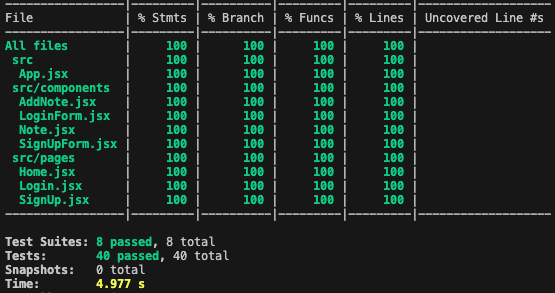
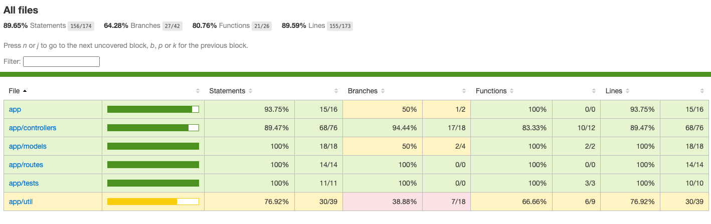

[](https://github.com/wadedesir/notes-app/actions/workflows/backend_checks.yml) [](https://github.com/wadedesir/notes-app/actions/workflows/frontend_checks.yml) [](https://opensource.org/licenses/MIT)

# 📝 Notes App
Welcome to [**Notes.app**](http://18.116.34.64:8420/), a simple and user-friendly application for managing notes. The application is powered by the MERN stack 💪 (Mongo, Express, React, Node). Explore the details of each component below:

## 🌐 Frontend

### [📝 Frontend README](frontend/README.md)
The frontend of the Notes App is built with React, Vite.js, and Tailwind CSS. It provides an intuitive interface for users to manage notes, with features like adding, editing, and deleting notes, as well as user authentication through login and signup forms.

## 🛠 Backend

### [📝 Backend README](backend/README.md)
The backend of the Notes App is powered by Node.js, Express.js, Mongoose, and Docker. It provides a robust API for managing notes, handling user authentication, and interacting with a MongoDB database. The backend follows a modular architecture with routes, controllers, models, and utilities for different aspects of the application logic.

## 🧪 Testing




A key objective of this project was learning and implementing tests. The READMEs for both the frontend and backend provide detailed insights into the testing strategies and methodologies. In this project we are utilizing Jest on both the frontend and backend for testing React, and Node.js (ES6).

- **Unit Test**: Tests that cover isolated modules or "units" of code without depending on outside modules. Typically, these test individual functions or branches of code.

- **Integration Test**: Tests that cover multiple modules together interacting with each other.

- **End-to-End Tests**: Tests functionality of an entire software application from start to finish by simulating UI interactions and replicating live data.

- **Test Case**: A series of tasks/functions that set an environment to verify functionality. It may include mocking data, running functions, and assertions.

- **Test Suite**: A group of logically similar tests that together cover test cases for one job.

- **Mocking**: Simulating data or functions in a test environment to avoid using live/production data or functions.

- **Assertion**: Declares the expected behavior or outcome of a test.

Here are some methods you may encounter throughout our tests and what they do:

- `describe()`: Instantiates a test suite. The first argument is a string that describes the suite, which is also the suite's name. The second argument is a callback function that can contain another suite or test.

- `test()` or `it()`: Instantiates a test. The first argument is the test description or name, and the second argument is a callback function containing the test. Both `test()` and `it()` have the same functionality but use different naming conventions for readability. For example:
  ```javascript
  test("Should do this thing", () => {
    // Test logic here
  })
  it("Does this thing", () => {
    // Test logic here
  })
  ```
- `jest.fn()`: This function mimics a function. When mocking dependencies within a test, you can use jest.fn() to simulate a function call and mock return data.

- `expect()`: Instantiates an assertion. expect() takes in a value and provides access to matchers that evaluate whether the value meets specific conditions. For example:
  ```javascript
  const name = "Notes-App"
  expect(name).toBe("Notes-App")
  ```
For more information about Jest and its capabilities, you can refer to the [Jest documentation](https://jestjs.io/docs/getting-started).


## 🚀 Getting Started
1. Clone the repository: `git clone https://github.com/wadedesir/notes-app.git`
2. Set up the backend as per the [Backend README](backend/README.md).
3. Set up the frontend as per the [Frontend README](frontend/README.md).
4. Explore, manage your notes, and enjoy using the Notes App!

## Made with love,
Jose, Kai, Sarah, Wade, & Zrybea ✨
